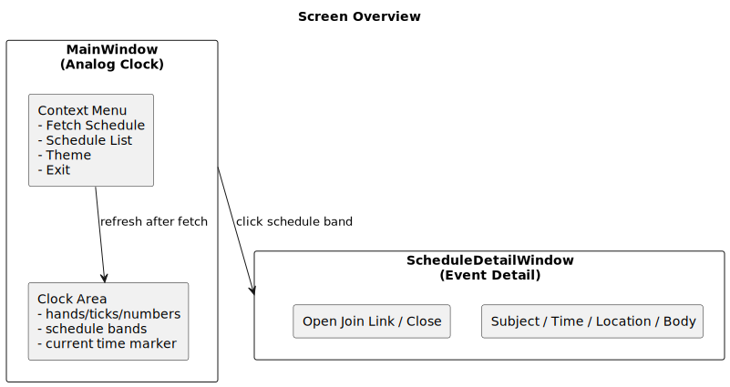
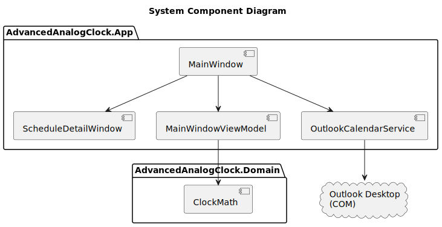
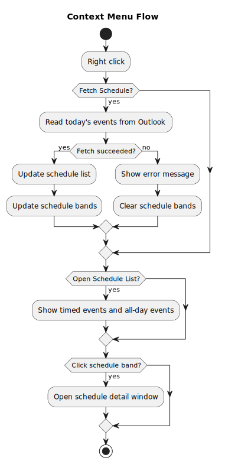

# Advanced Analog Clock 基本設計書（外部設計）

## 1. 文書管理

- 文書名: Advanced Analog Clock 基本設計書（外部設計）
- 対象システム: AdvancedAnalogClock
- 対象バージョン: 現行実装
- 作成日: 2026-04-07

## 2. 目的と適用範囲

本書は、Advanced Analog Clock の画面仕様、機能仕様、入出力仕様、外部インターフェース仕様、運用仕様を定義する。

本書の対象は以下とする。

- エンドユーザー向け挙動（外部仕様）
- UI 表示と操作
- Outlook 連携仕様
- 配布と起動運用

本書は、内部実装詳細（アルゴリズムコードレベル）を主目的としない。

## 3. システム概要

本システムは Windows デスクトップ上で動作する時計アプリである。  
Outlook デスクトップから当日予定を取得し、時計の文字盤表示および予定一覧表示を提供する。

主な提供価値:

- 常時参照しやすいアナログ時計
- Outlook 予定の時間帯可視化
- 予定詳細の即時参照（場所・本文・参加リンク）

## 4. システム構成

### 4.1 論理構成

- UI層
  - MainWindow
  - ScheduleDetailWindow
- ViewModel層
  - MainWindowViewModel
- ドメイン層
  - ClockMath（針角度計算）
- 外部連携層
  - OutlookCalendarService（Outlook COM）

### 4.2 外部依存

- Outlook デスクトップ COM
- .NET 8 Runtime

## 5. 画面外部設計

### 5.1 メイン画面（時計）

- 画面名: メイン時計ウィンドウ
- ウィンドウ形式: ボーダーレス
- 表示優先: 常に最前面
- 移動: 左ドラッグで移動
- リサイズ: 可能（縦横比 1:1 を強制維持）
- テーマ: ライト/ダーク

表示要素:

- 時計本体（目盛り、数字、時針、分針、秒針）
- 現在時刻目印（赤系、時針角追従）
- 予定帯オーバーレイ（時間指定予定のみ）
- 影表現（浮遊感）

### 5.2 予定詳細画面

- 画面名: 予定詳細ウィンドウ
- 起動契機: 文字盤の予定帯クリック

表示項目:

- 件名
- 時間
- 場所
- 本文（全文）
- 参加リンクを開くボタン
- 閉じるボタン

## 6. 画面イベント設計

### 6.1 メイン画面イベント

- 左ドラッグ: ウィンドウ移動
- 右クリック: コンテキストメニュー表示
- メニュー「予定を取得」: Outlook から当日予定を取得
- メニュー「予定一覧」: 取得済み予定を表示
- メニュー「ライト/ダーク」: テーマ切替
- メニュー「終了」: アプリ終了
- 予定帯ホバー: 件名ツールチップ表示
- 予定帯クリック: 予定詳細画面表示

### 6.2 詳細画面イベント

- 「参加リンクを開く」: URL を既定ブラウザで起動
- 「閉じる」: 詳細画面を閉じる

## 7. 機能外部設計

### 7.1 時計表示機能

- 1 秒周期で時刻更新
- 秒針はチクタク更新
- 目盛りは 60 分割

### 7.2 現在時刻目印機能

- 追従軸: 時針角度
- 目的: スケジュール重なり確認時の現在時刻位置把握
- 視認性方針: ぼかしなし、赤系強調

### 7.3 予定取得機能

- 起動時自動取得: しない
- 取得トリガー: 明示操作（「予定を取得」）
- 取得範囲: 当日
- 取得方式: Outlook COM

### 7.4 予定一覧表示機能

- 対象: 当日予定（終日含む）
- 並び順:
  1. 時間指定予定
  2. セパレータ（必要時）
  3. 終日予定
- 装飾規則:
  - 過去予定: 背景グレー
  - 現在進行中（時間指定）: ハイライト
  - 終日予定: ハイライト対象外

### 7.5 予定帯描画機能

- 表示対象: 時間指定予定のみ
- 形状: リング帯（開始-終了）
- 重なり: 最大 4 レーン
- 配色方針:
  - 隣接する予定帯が近似色にならないよう、離れた色相を優先して割当
  - 全体として類似色を避ける固定パレットを使用
  - パレット例: 赤 / オレンジ / 緑 / 青 / 紫

レーン割当規則:

- 同時刻開始時は会議リンクあり予定を外側優先
- 既に帯がある状態で新規開始した予定は内側へ
- 外側終了後に内側を外側へ詰め直さない
- 4 レーン超過分は表示対象外

## 8. データ項目設計

予定データ項目:

- Subject: 件名
- StartLocal: 開始日時（ローカル）
- EndLocal: 終了日時（ローカル）
- IsAllDay: 終日フラグ
- Location: 場所
- BodyPreview: 本文（全文）
- JoinUrl: 参加リンク候補 URL

## 9. 外部インターフェース設計

### 9.1 Outlook COM I/F

- 接続先: Outlook.Application
- 参照予定表: 既定の予定表フォルダ
- 取得条件: 当日範囲に一致する予定

### 9.2 参加リンク起動 I/F

- 起動方式: OS シェル経由で URL 起動
- 失敗時: エラーダイアログ表示

## 10. 例外・エラーハンドリング設計

### 10.1 予定取得失敗時

- 予定帯をクリア
- 予定一覧に失敗メッセージを表示
- アプリは継続動作

### 10.2 Outlook 未起動時

- 予定取得処理でエラー扱い
- ユーザーは再度「予定を取得」でリトライ可能

## 11. 非機能要件

### 11.1 性能

- 時計描画更新: 1秒周期
- 予定取得は手動トリガーのみ（常時ポーリングなし）

### 11.2 可用性

- 予定取得失敗でも時計機能は継続

### 11.3 保守性

- UI/サービス/ドメイン分割
- 角度計算は Domain 層へ分離

## 12. 運用・配布設計

### 12.1 開発起動

- dotnet run で起動

### 12.2 ビルド

- ソリューション単位でビルド

### 12.3 配布

- 単一ファイル publish を利用可能
- 出力ファイル名: AdvancedAnalogClock.exe

### 12.4 スタートアップ起動

- 配布 EXE をユーザーの Startup フォルダに配置して自動起動

## 13. 既知の制約

- Outlook デスクトップ依存（Web 単体環境は対象外）
- Outlook プロファイル状態により取得時間が変動
- 自動再取得は未実装（将来拡張候補）

## 14. 受け入れ観点（抜粋）

- 時計が 1 秒ごとに更新される
- リサイズしても縦横比が崩れない
- 「予定を取得」で当日予定が取得できる
- 予定一覧の装飾規則が仕様どおり
- 予定帯クリックで詳細ウィンドウが開く
- 参加リンクがある予定でリンク起動できる

## 15. 図解

### 15.1 画面構成図

PlantUML ソース: [docs/diagrams/基本設計書-01.puml](diagrams/基本設計書-01.puml)

図中ラベルの日本語解釈:

- MainWindow (Analog Clock): メイン時計ウィンドウ
- Clock Area: 時計表示領域（針/目盛り/数字/予定帯/現在時刻目印）
- Context Menu: 右クリックメニュー（予定取得、予定一覧、テーマ、終了）
- ScheduleDetailWindow (Event Detail): 予定詳細ウィンドウ
- click schedule band: 予定帯クリックで詳細を開く
- refresh after fetch: 予定取得後に表示を更新

### 15.2 システムコンポーネント図

PlantUML ソース: [docs/diagrams/基本設計書-02.puml](diagrams/基本設計書-02.puml)

図中ラベルの日本語解釈:

- System Component Diagram: システムコンポーネント図
- AdvancedAnalogClock.App: アプリケーション層
- AdvancedAnalogClock.Domain: ドメイン層
- Outlook Desktop (COM): Outlook デスクトップ連携先
- 矢印: 依存/呼び出し関係

### 15.3 コンテキストメニュー操作フロー

PlantUML ソース: [docs/diagrams/基本設計書-03.puml](diagrams/基本設計書-03.puml)

図中ラベルの日本語解釈:

- Right click: 時計上で右クリック
- Fetch Schedule: 予定を取得
- Read today's events from Outlook: Outlook から当日予定を取得
- Update schedule list: 予定一覧の更新
- Update schedule bands: 文字盤予定帯の更新
- Show error message: エラーメッセージ表示
- Clear schedule bands: 予定帯のクリア
- Open Schedule List: 予定一覧を開く
- Click schedule band: 予定帯クリック
- Open schedule detail window: 予定詳細ウィンドウを開く
