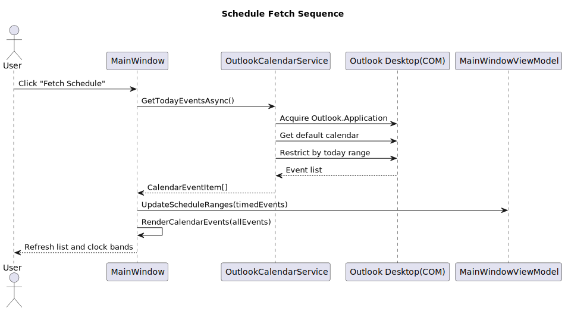
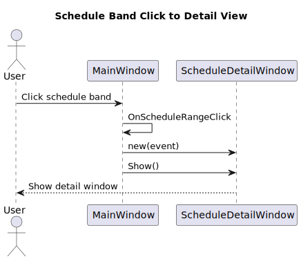
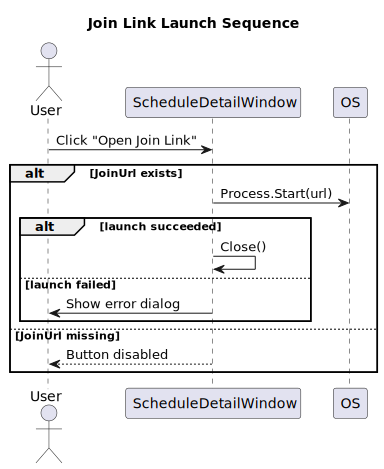
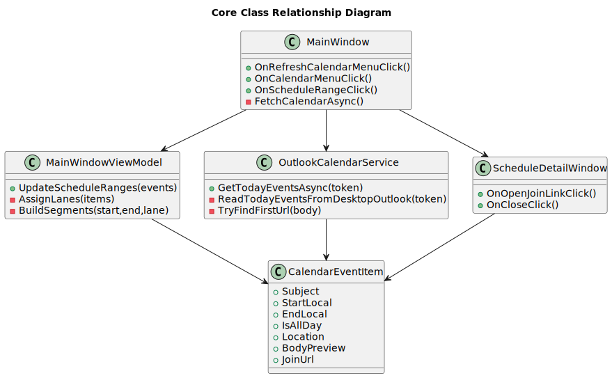

# Advanced Analog Clock 詳細設計書

## 1. 文書情報

- 文書名: Advanced Analog Clock 詳細設計書
- 対象システム: AdvancedAnalogClock
- 対象バージョン: 現行実装
- 関連文書: docs/基本設計書.md

## 2. 実装アーキテクチャ

### 2.1 レイヤ構成

- App(UI): WPF 画面、ユーザー操作、描画
- ViewModel: 表示状態管理、時計針角度、予定帯ジオメトリ生成
- Domain: 時計角度計算ロジック
- Services: Outlook COM 連携、予定取得・正規化
- Models: 予定データ表現

### 2.2 プロジェクト構成

- src/AdvancedAnalogClock/src/AdvancedAnalogClock.App
- src/AdvancedAnalogClock/src/AdvancedAnalogClock.Domain
- src/AdvancedAnalogClock/tests/AdvancedAnalogClock.Domain.Tests

## 3. モジュール詳細設計

### 3.1 MainWindow

役割:

- メイン画面表示
- コンテキストメニュー操作受付
- 予定取得トリガー
- 予定一覧メニュー描画
- 予定帯クリックで詳細画面起動
- テーマ適用
- ウィンドウのドラッグ移動、正方形リサイズ制御

主要イベント:

- OnWindowDragMove
- OnRefreshCalendarMenuClick
- OnCalendarMenuClick
- OnScheduleRangeClick
- OnLightModeMenuClick
- OnDarkModeMenuClick
- OnExitMenuClick

主要内部処理:

- FetchCalendarAsync
  - OutlookCalendarService.GetTodayEventsAsync 呼び出し
  - 全予定キャッシュと時間指定予定キャッシュを作成
  - ViewModel.UpdateScheduleRanges で文字盤反映
- RenderCalendarEvents
  - 時間指定予定と終日予定を分離
  - 必要時セパレータ挿入
  - 過去予定/進行中予定の見た目を適用

### 3.2 MainWindowViewModel

役割:

- 時計表示のバインド値管理
- 目盛り・数字配置データ生成
- 予定帯ジオメトリ生成

公開プロパティ:

- TickMarks
- NumberMarks
- ScheduleRanges
- HourAngle
- MinuteAngle
- SecondAngle
- CurrentTimeText

主要処理:

- UpdateClock
  - Domain の ClockMath.CalculateAngles を使用
- UpdateScheduleRanges
  - 終日予定除外
  - 重なりレーン割当（最大4レーン）
  - リング帯 PathGeometry 生成
  - 配色割当（隣接予定の色相分離）

予定帯配色仕様:

- 固定パレット（半透明）
  - #66EF4444 (赤)
  - #66F59E0B (オレンジ)
  - #6622C55E (緑)
  - #663B82F6 (青)
  - #66A855F7 (紫)
- 色割当順序（コントラスト優先）
  - インデックス順: [0, 2, 4, 1, 3]
  - 意図: 時系列で隣接する予定帯が近い色になりにくくする

重なりレーン規則:

- 最大4レーン
- 同時開始イベントは会議リンク付き予定を外側優先
- 空きレーンを外側から割当
- 終了時のレーン詰め替えは行わない

### 3.3 OutlookCalendarService

役割:

- Outlook COM から当日予定取得
- 予定項目の正規化
- 参加リンク候補抽出

主要処理フロー:

1. Outlook.Application を COM で取得
2. 既定カレンダーフォルダを取得
3. 当日範囲で Restrict
4. 各予定から Subject/Start/End/AllDay/Location/Body を抽出
5. CalendarEventItem へ詰め替え
6. JoinUrl を本文から抽出

JoinUrl 抽出ロジック:

- 本文から URL を正規表現で抽出
- 主要会議ドメイン優先
  - teams.microsoft.com
  - zoom.us
  - meet.google.com
  - webex.com
- 上記ドメインに一致しない場合は null

COM リソース解放:

- Marshal.FinalReleaseComObject を使用
- finally で確実に解放

### 3.4 ScheduleDetailWindow

役割:

- 予定詳細表示
- 参加リンク起動

表示項目:

- 件名
- 時間
- 場所
- 本文

操作:

- 参加リンクを開く
  - JoinUrl が null/空ならボタン無効
  - 起動成功後はウィンドウを閉じる
- 閉じる

### 3.5 Domain.ClockMath

役割:

- 現在時刻から時針/分針/秒針の角度を計算

入出力:

- 入力: DateTime, tickSecondHand
- 出力: ClockAngles

## 4. データ詳細設計

### 4.1 CalendarEventItem

項目:

- Subject: string (必須)
- StartLocal: DateTimeOffset (必須)
- EndLocal: DateTimeOffset (必須)
- IsAllDay: bool
- Location: string?
- BodyPreview: string?
- JoinUrl: string?

制約:

- Subject が空の場合は "(件名なし)" を設定
- JoinUrl は主要会議ドメイン一致時のみ設定

### 4.2 ClockScheduleRangeMark

項目:

- Geometry: Geometry (必須)
- Fill: Brush (必須)
- Stroke: Brush (必須)
- ToolTip: string (必須)
- Event: CalendarEventItem (必須)

## 5. 主要シーケンス

### 5.1 予定取得

1. ユーザーが「予定を取得」をクリック
2. MainWindow.FetchCalendarAsync 実行
3. OutlookCalendarService で当日予定取得
4. MainWindow が予定一覧キャッシュを更新
5. MainWindowViewModel.UpdateScheduleRanges で文字盤帯更新
6. 予定一覧メニュー内容を再描画

### 5.2 予定帯クリック

1. ユーザーが文字盤の予定帯をクリック
2. MainWindow.OnScheduleRangeClick 発火
3. 対応する CalendarEventItem を取得
4. ScheduleDetailWindow を生成して表示

### 5.3 参加リンク起動

1. ユーザーが詳細画面で「参加リンクを開く」をクリック
2. Process.Start で URL を OS に委譲
3. 成功時に詳細画面を閉じる
4. 失敗時にエラーダイアログ表示

## 6. UI 詳細設計

### 6.1 テーマ

- Light/Dark を DynamicResource で切替
- 時計面、目盛り、針、中心点の色を切替
- 予定帯色はテーマ色と独立した固定パレットで描画

### 6.2 影表現

- 時計背面に複数の楕円影を配置
- BlurEffect を用いて浮遊感を表現
- 影が切れないよう外側描画領域を拡張

### 6.3 現在時刻目印

- 文字盤外周に赤系ライン表示
- HourAngle に追従
- ぼかしなしで視認性優先

## 7. 例外処理詳細

- Outlook が見つからない/起動失敗: 取得失敗表示
- COM 例外: ユーザー向けメッセージ表示
- 参加リンク起動失敗: 詳細画面でエラーダイアログ

## 8. テスト設計（現状）

- Domain 層の時計角度計算をユニットテスト
- App 層の UI/COM は手動確認主体

今後追加推奨:

- 予定帯レーン割当ロジックの単体テスト
- URL 抽出ロジックの単体テスト

## 9. 非機能設計

- パフォーマンス方針
  - 起動時自動取得は行わない
  - 予定取得は手動トリガー
- 可用性方針
  - 予定取得失敗時も時計機能は継続
- 保守性方針
  - 役割ごとに層分離

## 10. 既知制約と拡張余地

既知制約:

- Outlook COM 依存のため Outlook デスクトップ必須
- 予定取得時間は Outlook 状態に依存

拡張余地:

- 自動再取得（バックグラウンド化前提）
- 参加リンク候補複数提示 UI
- 予定作成/編集機能

## 11. 詳細図

### 11.1 予定取得シーケンス図

PlantUML ソース: [docs/diagrams/詳細設計書-01.puml](diagrams/詳細設計書-01.puml)

図中ラベルの日本語解釈:

- Schedule Fetch Sequence: 予定取得シーケンス
- Click "Fetch Schedule": 「予定を取得」をクリック
- Acquire Outlook.Application: Outlook アプリケーション COM を取得
- Get default calendar: 既定カレンダーを取得
- Restrict by today range: 当日条件で絞り込み
- Event list: 取得予定一覧
- Refresh list and clock bands: 一覧と文字盤予定帯を更新

### 11.2 予定帯クリックから詳細表示シーケンス図

PlantUML ソース: [docs/diagrams/詳細設計書-02.puml](diagrams/詳細設計書-02.puml)

図中ラベルの日本語解釈:

- Schedule Band Click to Detail View: 予定帯クリックから詳細表示
- Click schedule band: 予定帯をクリック
- OnScheduleRangeClick: クリックイベントハンドラ
- new(event): 予定データで詳細画面を生成
- Show detail window: 詳細ウィンドウを表示

### 11.3 参加リンク起動シーケンス図

PlantUML ソース: [docs/diagrams/詳細設計書-03.puml](diagrams/詳細設計書-03.puml)

図中ラベルの日本語解釈:

- Join Link Launch Sequence: 参加リンク起動シーケンス
- Click "Open Join Link": 「参加リンクを開く」をクリック
- JoinUrl exists: 参加リンクが存在する場合
- launch succeeded: 起動成功
- launch failed: 起動失敗
- Show error dialog: エラーダイアログ表示
- JoinUrl missing: 参加リンクがない場合（ボタン非活性）

### 11.4 主要クラス関連図

PlantUML ソース: [docs/diagrams/詳細設計書-04.puml](diagrams/詳細設計書-04.puml)

図中ラベルの日本語解釈:

- Core Class Relationship Diagram: 主要クラス関連図
- MainWindow: メイン画面制御
- MainWindowViewModel: 表示状態・予定帯生成
- OutlookCalendarService: Outlook 予定取得
- ScheduleDetailWindow: 予定詳細表示
- CalendarEventItem: 予定データモデル
- 矢印: 呼び出し/参照関係
